# 📰 Newspaper Management System

> A modern newspaper editorial management system built with Django and Material Design

[](https://www.djangoproject.com/)
[](https://www.python.org/)
[](https://www.creative-tim.com/product/material-kit)
[](LICENSE)

## 📋 About The Project

Newspaper Management System is a full-featured web platform for managing newspaper editorial operations. The system enables efficient organization of editorial work, topic management, and article publication through a modern and intuitive interface based on Django Material Kit.

### [View Website](https://newspaper-system.onrender.com) https://newspaper-system.onrender.com
login: test
password: password333


### ✨ Key Features

- 👥 **Redactor Management** - Create profiles, track years of experience
- 📝 **Article Management** - Full CRUD functionality for publications
- 🏷️ **Topic System** - Organize content by categories
- 🔍 **Search & Filtering** - Quick search for articles and redactors
- 🎨 **Material Design UI** - Modern and responsive interface
- 🔐 **Authentication** - User login and management system
- 📊 **Statistics** - Track article counts and activity
- 👤 **Custom User Model** - Extended AbstractUser for redactors
- 🔗 **Article Assignment** - Toggle redactor assignment to articles

## 🚀 Quick Start

### Prerequisites

- Python 3.8+
- pip
- virtualenv (recommended)

### Installation

1. **Clone the repository**
```bash
git clone https://github.com/vkalinina/newspaper
cd newspaper
```

2. **Create virtual environment**
```bash
python -m venv venv
source venv/bin/activate  # Linux/Mac
venv\Scripts\activate     # Windows
```

3. **Install dependencies**
```bash
pip install -r requirements.txt
```

4. **Apply migrations**
```bash
python manage.py migrate
```

5. **Load test data**
```bash
python manage.py shell < populate_db.py
```

6. **Run development server**
```bash
python manage.py runserver
```

7. **Open browser**
```
http://127.0.0.1:8000/
```

## 🎯 Usage

### Login Credentials (after loading test data)

**Administrator:**
- Username: `admin`
- Password: `admin123`

**Redactors:**
- Username: `john_smith` / Password: `password123`
- Username: `emily_johnson` / Password: `password123`
- Username: `michael_brown` / Password: `password123`
- Username: `sarah_davis` / Password: `password123`
- Username: `david_wilson` / Password: `password123`

### Main URLs

- `/` - Home page
- `/redactors/` - Redactor list
- `/topics/` - Topic list
- `/articles/` - Article list
- `/admin/` - Django admin panel

## 📁 Project Structure

```
newspaper/
├── catalog/                 # Main application
│   ├── migrations/         # Database migrations
│   ├── static/            # Static files (CSS, JS, images)
│   ├── templates/         # HTML templates
│   │   └── catalog/       # App templates
│   ├── models.py          # Data models
│   ├── views.py           # Views
│   ├── urls.py            # URL routes
│   └── forms.py           # Django forms
├── newspaper/              # Project settings
│   ├── settings.py        # Django configuration
│   ├── urls.py            # Main URL config
│   └── wsgi.py            # WSGI configuration
├── populate_db.py          # Database population script
├── manage.py              # Django management utility
└── requirements.txt       # Project dependencies
```

## 🗄️ Data Models

### Redactor (extends AbstractUser)
- Extends Django's AbstractUser model
- Field: `years_of_experience` (years of professional experience)
- Custom user model for the entire project

### Topic
- `name` - Topic name (unique)
- Ordered alphabetically

### Article
- `title` - Article title
- `content` - Article content
- `published_date` - Publication date
- `topic` - Related topic (ForeignKey)
- `redactors` - Related redactors (ManyToMany)
- Ordered by publication date (newest first)

## 🎨 Technologies Used

### Backend
- **Django 4.x** - Main web framework
- **SQLite** - Database (can be replaced with PostgreSQL/MySQL)
- **Django Auth** - Custom authentication system with AbstractUser

### Frontend
- **Material Kit** - Material Design based UI framework
- **Bootstrap 5** - Responsive grid and components
- **HTML5/CSS3** - Modern markup
- **JavaScript** - Interactivity

## 📝 Main Features

### Redactor Management
- View all redactors
- Create new redactor profiles
- Update redactor information
- Delete redactors
- Filter by username
- Track years of experience

### Article Management
- Create new articles
- Assign redactors to articles
- Link articles to topics
- Edit content
- Delete articles
- Search by title
- Toggle assignment feature (assign/unassign current user to articles)

### Topic Management
- Create topic categories
- Group articles by topics
- Edit topic details
- Search topics by name

## 🔧 Configuration

### Database Setup

By default, SQLite is used. To use PostgreSQL:

1. Install `psycopg2`:
```bash
pip install psycopg2-binary
```

2. Update `settings.py`:
```python
DATABASES = {
    'default': {
        'ENGINE': 'django.db.backends.postgresql',
        'NAME': 'newspaper_db',
        'USER': 'your_username',
        'PASSWORD': 'your_password',
        'HOST': 'localhost',
        'PORT': '5432',
    }
}
```

### Custom User Model

This project uses a custom user model (Redactor) that extends AbstractUser:

```python
AUTH_USER_MODEL = 'catalog.Redactor'
```

Make sure to set this before running initial migrations.

### Static Files Configuration

```python
STATIC_URL = '/static/'
STATIC_ROOT = os.path.join(BASE_DIR, 'staticfiles')
STATICFILES_DIRS = [os.path.join(BASE_DIR, 'catalog/static')]
```

For production:
```bash
python manage.py collectstatic
```

## 🚢 Deployment

### Production Preparation

1. Set `DEBUG = False` in `settings.py`
2. Configure `ALLOWED_HOSTS`
3. Use environment variables for secrets
4. Configure proper database
5. Collect static files

### Example with Gunicorn

```bash
pip install gunicorn
gunicorn newspaper.wsgi:application --bind 0.0.0.0:8000
```

### Example with Docker

```dockerfile
FROM python:3.9
WORKDIR /app
COPY requirements.txt .
RUN pip install -r requirements.txt
COPY . .
RUN python manage.py collectstatic --noinput
CMD ["gunicorn", "newspaper.wsgi:application", "--bind", "0.0.0.0:8000"]
```

## 🔑 Key Implementation Details

### Login Required
All views require authentication using `@login_required` decorator or `LoginRequiredMixin`

### Search Forms
- Redactor search by username
- Article search by title
- Topic search by name

### Query Optimization
- `select_related()` for foreign keys (Article -> Topic)
- `prefetch_related()` for many-to-many (Redactor -> Articles)

### Toggle Assignment Feature
Logged-in users can assign/unassign themselves to articles via the `toggle_assign_to_articles` view

## 🤝 Contributing

Contributions are welcome! Process for contributing:

1. Fork the repository
2. Create feature branch (`git checkout -b feature/AmazingFeature`)
3. Commit changes (`git commit -m 'Add some AmazingFeature'`)
4. Push to branch (`git push origin feature/AmazingFeature`)
5. Open a Pull Request

## 📄 License

This project is licensed under the MIT License. See [LICENSE](LICENSE) file for details.

## 📧 Contact

Viktoria Kalinina - https://www.linkedin.com/in/viktoria-kalinina-7ab10636a/

Project Link: [https://github.com/vkalinina/newspaper](https://github.com/vkalinina/newspaper)

## 🙏 Acknowledgments

- [Django](https://www.djangoproject.com/) - Excellent web framework
- [Material Kit](https://www.creative-tim.com/product/material-kit) - Beautiful UI Kit
- [Bootstrap](https://getbootstrap.com/) - Responsive CSS framework
- Django community for support and documentation

## 📚 Additional Resources

- [Django Documentation](https://docs.djangoproject.com/)
- [Material Kit Documentation](https://demos.creative-tim.com/material-kit/docs/2.0/getting-started/introduction.html)
- [Django Best Practices](https://django-best-practices.readthedocs.io/)

##   Demo

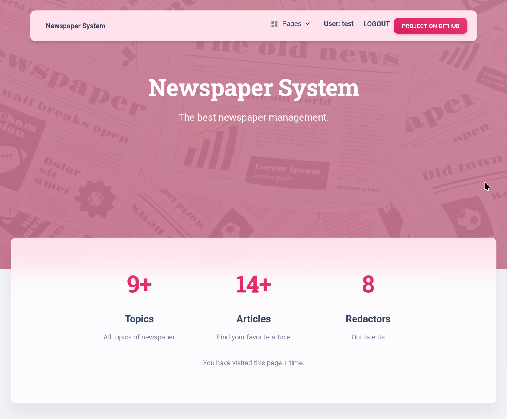
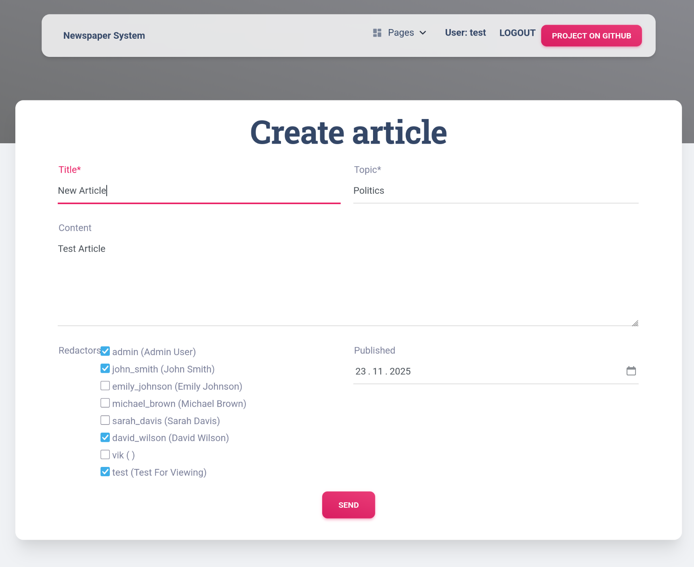
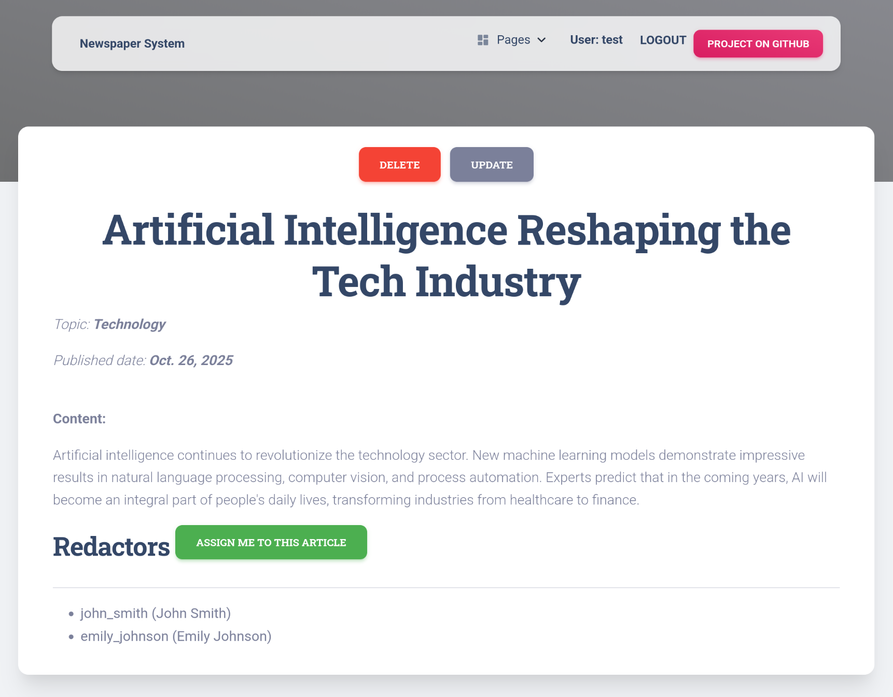
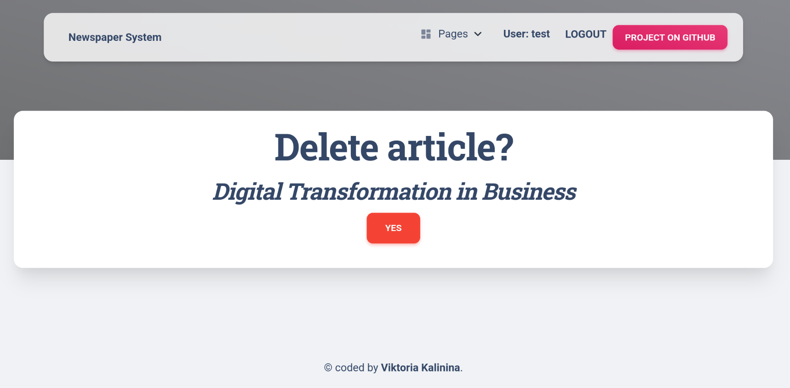
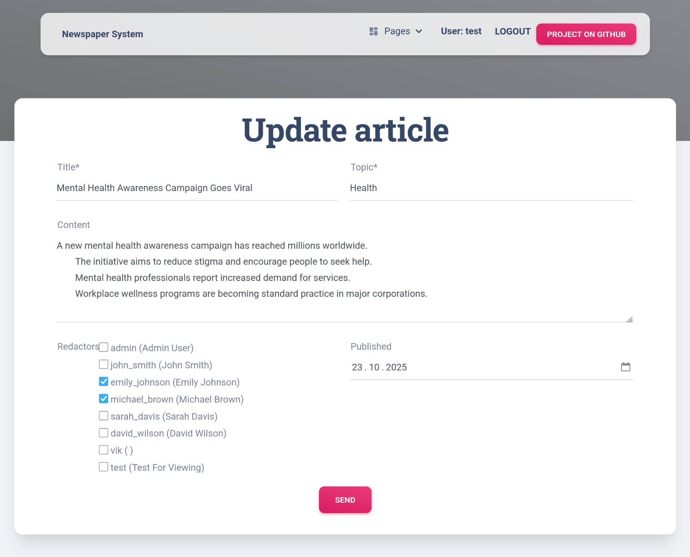
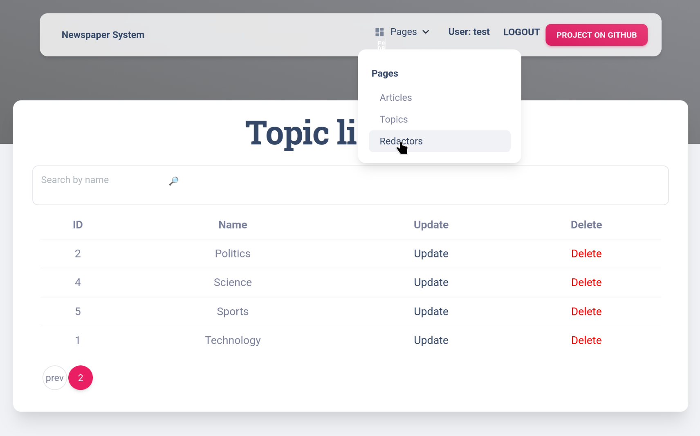
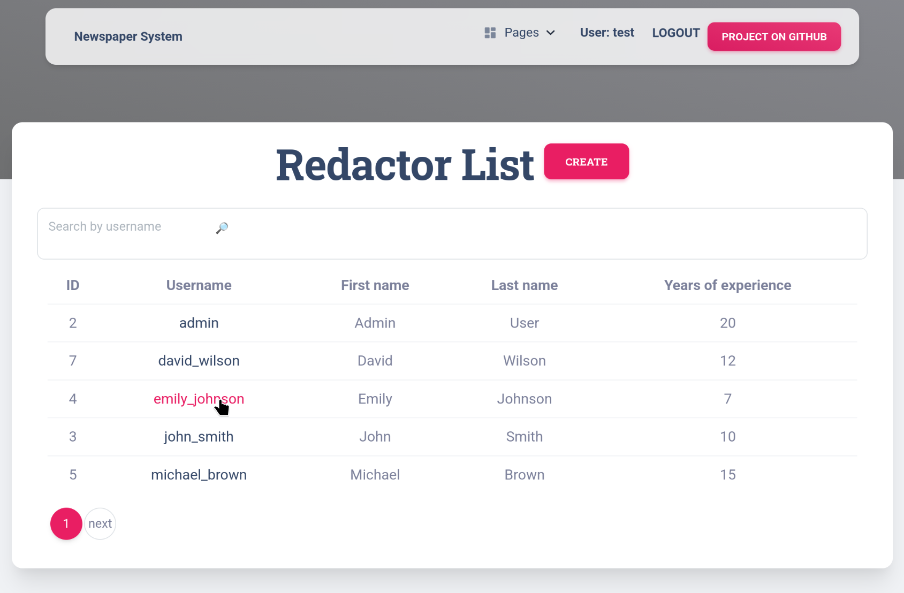
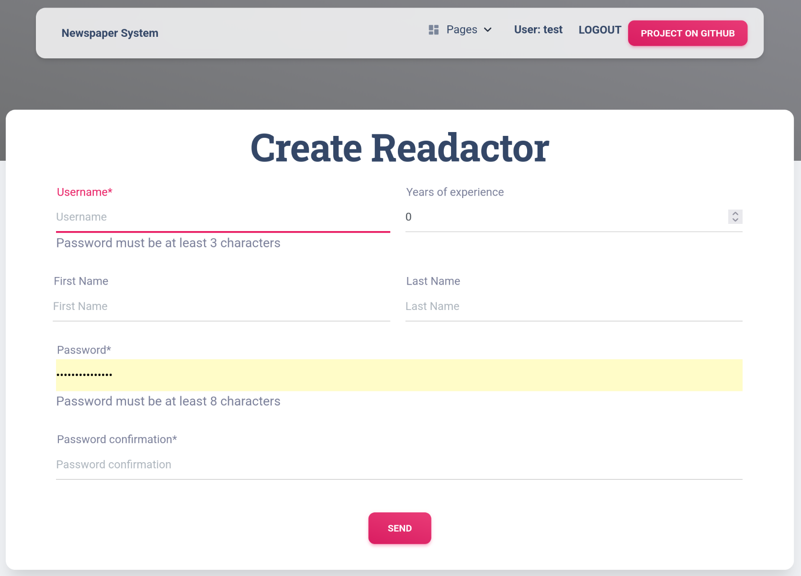
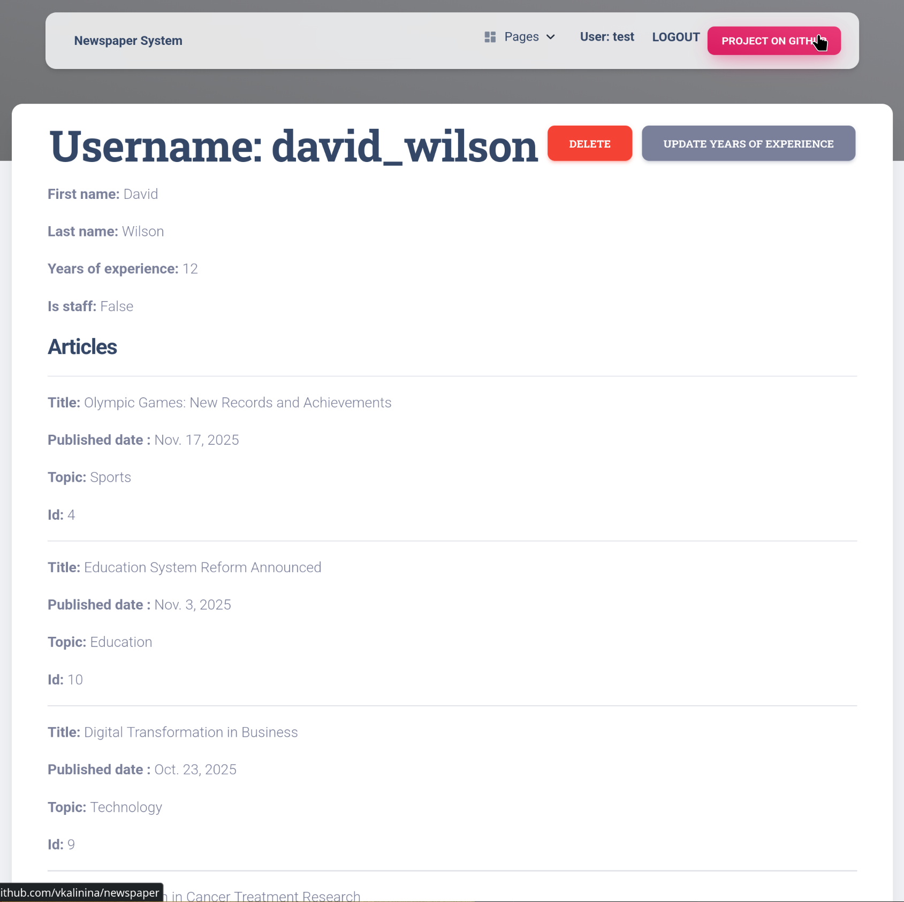
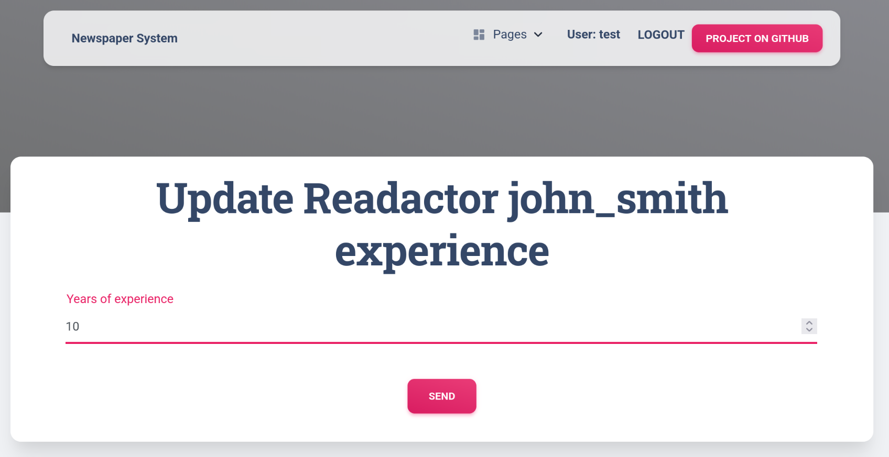
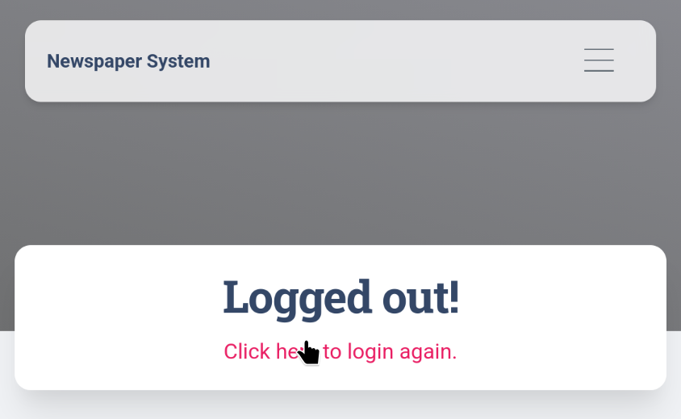


---

⭐️ If you found this project helpful, please give it a star on GitHub!
